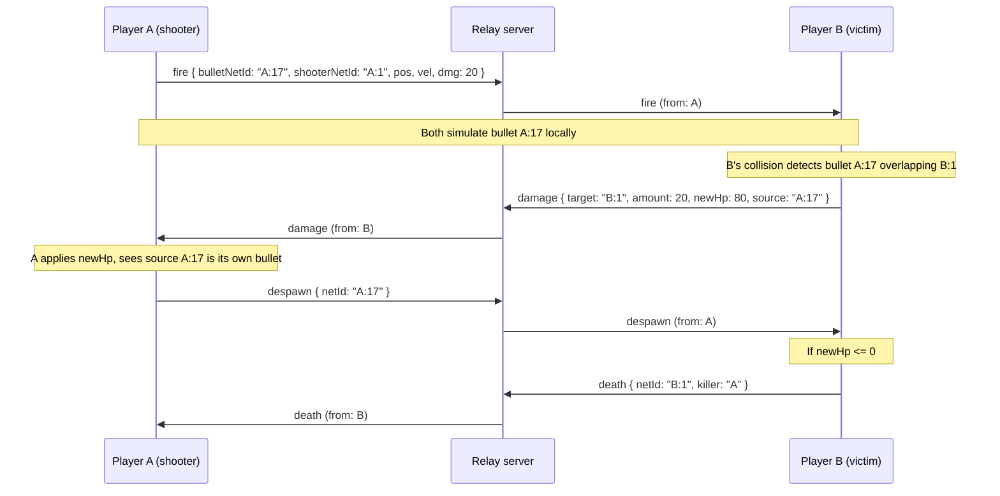

# Multiplayer Protocol

The wire protocol shared by the relay server (`server/`) and the engine client.
The server is a **dumb relay**: it runs no simulation, never interprets
gameplay payloads and only routes messages between players. All gameplay
decisions happen on the clients.

| Item | Value |
| --- | --- |
| Transport | WebSocket, one JSON object per message. |
| Source of truth | [`server/src/protocol.ts`](../server/src/protocol.ts) — types plus a runtime validator for every message. This document describes it for humans. |
| Version | `PROTOCOL_VERSION = 1`, sent by the client in `hello.version`. |
| Max message size | `MAX_MESSAGE_BYTES = 16384` (16 KB). Larger messages are dropped. |
| Units | Positions in world pixels, velocity in px/s, acceleration in px/s² (**local space**, same as `RigidBodyComponent.acceleration`: the engine rotates it by `rot`), **rotation in radians** (same as `TransformComponent.rotation`). |

---

## Envelope

Every message is a JSON object with these fields, plus the payload fields of
its type:

```json
{ "t": "state", "from": "k3f9", "seq": 412, "ts": 1718000000123, "netId": "k3f9:1", "...": "..." }
```

| Field | Type | Meaning |
| --- | --- | --- |
| `t` | string | Message type (see the reference below). |
| `from` | string | PlayerId of the sender. **Stamped by the server**, overwriting whatever the client sent, so clients cannot spoof ownership. Clients may omit it. |
| `to` | string, optional | PlayerId of a single recipient. Omitted means broadcast. |
| `seq` | integer >= 0 | Per-sender counter. Receivers drop a `state` whose `seq` is not greater than the last one seen from that sender. |
| `ts` | number | Sender's clock in milliseconds. Informational only; clocks are not synchronised. |

**Routing.** With `to` set, the server forwards only to that client (dropped if
unknown). Without it, the server broadcasts to everyone **except the sender**.

**Validation.** The server validates incoming messages with
`validateClientMessage` (full payload check, `from` not required; use
`isClientEnvelope` for an envelope-only check), stamps `from`, then forwards. Receivers can use
`validateMessage`, which requires `from`. Messages of server-only types
(`welcome`, `peer_joined`, `peer_left`, `host_changed`) sent by a client are
dropped (`isServerOnlyType`).

---

## Net IDs

Every networked entity has a `netId` of the form `"<playerId>:<counter>"`, for
example `"k3f9:17"`. It is generated by the **owner** from its own counter, so
no server allocation is needed and IDs never collide. `netIdOwner` returns the
original generator; after host migration the *current* owner can differ, so
always use the `owner` field from `spawn` / `snapshot` for authority.

---

## Ownership rules

1. **Everyone simulates everything.** Events correct the local simulation; they
   do not replace it. A bullet flies on every client from `fire` onward, and
   `state` only nudges remote copies back towards the owner's truth.
2. **Every networked entity has an owner.** A player owns their ship and their
   bullets. The **host** (earliest-joined player still connected) owns world
   entities: asteroids, enemies, loot and the game director.
3. **Only the owner spawns** an entity (`spawn`) **and only the owner removes
   it** (`despawn` / `death`). Nobody else may create or delete it.
4. **Receiver-authoritative critical events.** HP changes and deaths are
   decided **only by the owner of the entity being hit**, from its own local
   collision detection. Everyone else applies the owner's `damage` / `death`
   events and never changes HP on their own. This avoids disagreements caused
   by latency: the victim sees the hit as it really happened on its screen.
5. **Host migration.** When the host leaves, the server sends `host_changed`
   and the new host adopts every entity the old host owned.

---

## Message reference

Sender is who may legitimately originate the message. Direction is relative to
the server. "Broadcast" excludes the sender.

### Session

| Type | Direction | Sender | Fields | Notes |
| --- | --- | --- | --- | --- |
| `welcome` | server -> client | server | `playerId`, `hostId`, `peers[]` | Direct, first message after connecting. |
| `peer_joined` | server -> clients | server | `playerId` | A new player connected. |
| `peer_left` | server -> clients | server | `playerId` | A player disconnected. |
| `host_changed` | server -> clients | server | `hostId` | The host left; rule 5. |
| `hello` | client -> server | client | `name`, `version` | Sent once after connecting. `version` must equal `PROTOCOL_VERSION`. |

```json
{ "t": "welcome", "from": "server", "seq": 0, "ts": 1718000000000,
  "playerId": "k3f9", "hostId": "a1b2", "peers": ["a1b2"] }
```

### Entities

| Type | Direction | Sender | Fields | Notes |
| --- | --- | --- | --- | --- |
| `spawn` | client -> all | owner | `netId`, `owner`, `script`, `state` | `state` is `{ pos, vel, rot, acc, hp? }` plus any script-specific extras. `script` is a prefab path relative to `assets/scripts/prefabs/` (e.g. `player/remote_player.lua`). Rule 3. |
| `despawn` | client -> all | owner | `netId` | Removes the entity everywhere. Rule 3. |
| `state` | client -> all | owner | `netId`, `pos`, `vel`, `rot`, `acc` | Periodic correction of the owner's entity. Stale ones (by `seq`) are dropped. Rule 1. |

```json
{ "t": "state", "from": "k3f9", "seq": 412, "ts": 1718000000123, "netId": "k3f9:1",
  "pos": { "x": 640.5, "y": 360 }, "vel": { "x": 12, "y": -3 },
  "rot": 1.5708, "acc": { "x": 0, "y": 0 } }
```

### Combat

| Type | Direction | Sender | Fields | Notes |
| --- | --- | --- | --- | --- |
| `fire` | client -> all | shooter | `bulletNetId`, `shooterNetId`, `pos`, `vel`, `dmg` | A bullet was fired; every client simulates it locally. The shooter owns the bullet. The engine handles it: it builds `prefabs/bullet.lua` at `pos` / `vel` with `dmg`, `fromPlayer = true` and the collider owner set to the shooter's ship, and registers it as `bulletNetId` owned by the sender. Bullets live 2 s on every client (`bullet_lifetime.lua`) and expire without a `despawn`. |
| `damage` | client -> all | owner of `target` | `target`, `amount`, `newHp`, `source?` | Rule 4. Receivers set the target's HP to `newHp`. `source` is the bullet / entity netId. |
| `death` | client -> all | owner of `netId` | `netId`, `killer?` | Rule 4. `killer` is a PlayerId. |

```json
{ "t": "damage", "from": "b7c8", "seq": 90, "ts": 1718000001000,
  "target": "b7c8:1", "amount": 20, "newHp": 80, "source": "k3f9:17" }
```

### Loot

| Type | Direction | Sender | Fields | Notes |
| --- | --- | --- | --- | --- |
| `pickup_request` | client -> loot owner | any player | `lootNetId` | Sent direct (`to`) to the loot's owner, normally the host. |
| `loot_taken` | client -> all | loot owner | `lootNetId`, `by` | Broadcast reply; **first request wins**. Later requests for the same loot are ignored. |

### Join and settings

| Type | Direction | Sender | Fields | Notes |
| --- | --- | --- | --- | --- |
| `snapshot_request` | client -> all | joining player | (none) | A plain broadcast; the server does not treat it specially. The host answers with `snapshot`; other players answer with a direct `spawn` of their own ship. Sent by the engine after every scene load and reconnect. |
| `snapshot` | client -> client | host | `entities[]`, `settings` | Direct (`to` = requester). Each entity is `{ netId, owner, script, state }`; `settings` is `{ pvp }`. |
| `room_settings` | client -> all | host | `pvp` | Changes room-wide settings. |

### Custom

| Type | Direction | Sender | Fields | Notes |
| --- | --- | --- | --- | --- |
| `custom` | client -> all, or direct | any player | `type`, `data?` | Script-level message. `type` is a string of 1-64 characters; `data` is any JSON and is relayed untouched. Broadcast, or direct with `to`. Used by the Lua `net_send` / `net_on` for any type that is not a protocol message. |

```json
{ "t": "custom", "from": "k3f9", "seq": 7, "ts": 1718000000456,
  "type": "chat", "data": { "text": "hola" } }
```

---

## Example: a bullet hits a remote player

Player A shoots player B. A owns the bullet `A:17`, B owns its ship `B:1`.
Following rule 4, B alone decides the hit and the damage.



1. **A fires.** A creates the bullet locally and broadcasts `fire` with the
   bullet's `bulletNetId` (`A:17`), start position, velocity and damage. The
   server stamps `from: "A"` and forwards it to B.
2. **Everyone simulates.** B creates its own copy of `A:17` from the event and
   both clients move it with the same physics (rule 1). No further messages
   are needed while it flies.
3. **B detects the hit.** B's collision system sees `A:17` overlap its ship
   `B:1`. Only B, as owner of the entity being hit, may act on this (rule 4).
4. **B reports the damage.** B reduces its own HP and broadcasts `damage` with
   `target: "B:1"`, `amount`, the resulting `newHp` and `source: "A:17"`.
   Other clients set B's HP to `newHp`; they never compute it.
5. **A removes its bullet.** Receiving `damage` whose `source` is its own
   bullet (or its own local collision), A, as the bullet's owner, broadcasts
   `despawn { netId: "A:17" }` (rule 3). B drops its copy of the bullet.
6. **If B dies.** When `newHp <= 0`, B broadcasts `death { netId: "B:1",
   killer: "A" }` and then despawns its ship as the owner (rules 3 and 4).

The engine enforces rule 4 on receipt: a `damage` or `death` whose `from` is not
the owner of the target is ignored, and the shooter despawns its bullet on
`damage.source` (see `DamageSync` in `src/Network/DamageSync.hpp`).

---

## Host migration

The host is the earliest-joined player still connected. When it disconnects
the server broadcasts `peer_left` and then `host_changed { hostId }` naming
the next oldest player. NetIds keep the old prefix and stay valid. The engine
logic lives in `WorldSync` (`src/Network/WorldSync.hpp`):

- **World entities.** Entities the host owns on behalf of the world (asteroids,
  ring rocks, enemies, loot) are announced with `"world": true` inside
  `spawn.state` (`net_spawn(prefab, {..., world = true})`). Ships and bullets
  are not world entities.
- **`peer_left` cleanup.** Every client removes (plain kill, no `on_death`) the
  non-world entities owned by the player that left: its ship and bullets. Since
  `peer_left` arrives before `host_changed`, they are gone before adoption.
  World entities stay.
- **`host_changed`.** Every client (not just the new host) rewrites the owner
  of the world entities owned by the old host to the new host. Otherwise
  receivers would drop the new host's `state`, `damage` and `death` (they check
  `from == ownerId`). The new host also broadcasts the announcement
  `{t:"custom", type:"host_adopt", data:{oldHostId}}`.
- **`host_adopt`.** Idempotent safety net: accepted only when `from` is the
  current host; reassigns the world entities of `data.oldHostId` to `from`.
- **`world_reset`.** `{t:"custom", type:"world_reset", data:{}}`, sent by the
  host before it reloads the same scene (restart after game over). Going back
  to the menu disconnects instead, so the world migrates to the next host and
  no `world_reset` is sent. Accepted only from
  the host; every client removes the world entities that host owned, so no
  orphaned copies of the old world remain.
- **Reconcile on `welcome`.** World entities created while connecting or
  offline (owner `""`), or owned by the previous connection's player id, are
  adopted if the welcome says we are the host; otherwise they are removed and
  come back through the host's `snapshot`.

---

## Running the relay server

```
cd server && npm install && npm run dev
```

Listens on `PORT` (default 7777). Limits and close codes:

| Item | Value |
| --- | --- |
| Max message size | 16 KB. Larger frames close the connection with **1009**. |
| Rate limit | Token bucket, 120 msg/s (burst 240). Abusive clients are closed with **1008**. |
| Heartbeat | Ping every 5 s; a socket that misses a pong is terminated (~10 s). |
| Version mismatch | `hello.version != PROTOCOL_VERSION` closes with **4000**. |

Invalid, server-only-type or mis-addressed messages are dropped and logged
(JSON lines on stdout) without disconnecting the client.

To test a single game instance, run a fake player next to it with
`npm run bot -- --host --pvp` (flags: `--url`, `--name`, `--host`, `--pvp`,
`--radius`, `--cx`, `--cy`, `--fire-interval`, `--duration`). See
`server/README.md`.


---

## Engine client

The engine connects with `NetClient` (`src/Network/`). The server URL is
configured with `./engine --server ws://localhost:7777` or
`GAME_SERVER=ws://localhost:7777`, but the engine does **not** connect at
startup: the connection is made only when the player picks **Multiplayer** (M)
in the main menu, which waits for `welcome` before loading the solar system
scene (so a newcomer already knows whether it is the host). ENTER (single
player) never touches the network, and without a URL the Multiplayer option
shows a hint instead. Multiplayer only exists in the solar system scene.

Returning to the main menu disconnects (`net_disconnect()`), so the other
players receive `peer_left` and drop that ship. If the link drops during a
game, `NetClient` keeps retrying and the director shows a "Connection to server
lost" banner with `M - Main menu`; on reconnect the `welcome` and
`snapshot_request` resync the world and the banner disappears.

```
cd server && npm install && npm run dev      # relay
cd server && npm run bot -- --host           # optional fake player
./engine --server ws://localhost:7777        # then pick Multiplayer (M) in the menu
```

On connect it sends `hello` (`name`, `version`) and logs `[Net] connected`,
`[Net] welcome`, `peer_joined`, `peer_left`, `host_changed` and
`[Net] disconnected`. It reconnects automatically and sends a new `hello` each
time.

Threading rule: IXWebSocket's thread only parses messages and pushes them to a
mutex-protected queue. `NetClient::poll()` runs at the start of `Game::update()`,
before `Registry::update()` and the scripts, and is the only place that updates
state (`myPlayerId`, `hostId`, `peers`), logs and calls handlers registered with
`subscribe(type, handler)`. Never touch the registry from the socket thread.

### World snapshot

The engine host answers `snapshot_request` with `snapshot` messages
(`to` = requester, `settings.pvp`). Each entity it owns with a prefab script
(and HP > 0) becomes `{netId, owner, script, state}`, where `state` is the
state it was announced with overlaid with the current `pos`, `rot`, `vel`,
`acc` and `hp`. The list is split in chunks so every message stays under about
12 KB (the relay closes the connection at 16 KB). Receivers dedupe by netId.

Single-instance testing with the bot needs the **engine to be the host** (start
the engine before the bot), because the bot spawns no world.

### Player ships

The local ship is a scene entity (`player.lua`). Once online it registers itself
with `net_register` and announces
`spawn { script: "player/remote_player.lua", state }`, where `state` is
`{ pos, vel, rot, acc, hp, name, max_hp, max_speed, engine, gun, shield }`.
Other clients build the ship from that prefab (name, HP bar from `max_hp`, thrust
flame from the replicated `acc`). The ship re-sends its `spawn` directly (`to`)
to every `peer_joined`, since the newcomer missed the broadcast.

Loading a scene (leaving the menu, for example) clears every entity, including
remote ones that arrived earlier. So after each scene load, and after each
`welcome` on reconnect, the engine broadcasts `snapshot_request`. The host
answers with a `snapshot`, and the engine builds each of its `entities` like a
`spawn`. Every other player (engine `player.lua` and the bot) answers with a
direct `spawn` of its own ship. Duplicates are ignored by `netId`.

When an upgrade
changes the ship's stats, the owner broadcasts the custom message
`player_stats { netId, max_hp, max_speed, engine, gun, shield }` so remote copies
update their HP bar and speed cap. If a `damage` carries a `newHp` above the
receiver's known maximum, the receiver raises its copy's maximum instead of clamping.

### Lua scripting

Gameplay scripts reach all of this through the `net_*` functions (see the
Network section of [lua-api.md](lua-api.md)). `NetworkScripting`
(`src/Network/`) subscribes to `custom`, `spawn` and `despawn` in `NetClient`:
`custom` is dispatched to `net_on` handlers by its `type`; an incoming `spawn`
builds the prefab named by `script` (relative to `assets/scripts/prefabs/`) and
registers it with the message's `netId` and `owner`; `despawn` kills the
matching entity; `fire` builds a replica bullet (see the `fire` row above).
Lua tables are converted to JSON by `src/Network/LuaJson.hpp`.
The fake bot answers `custom` `ping` with a direct `pong`, which allows a
single-instance round-trip check.

### Network identity

Entities shared between machines carry a `NetworkComponent` (`netId`, `ownerId`),
managed through `NetworkRegistry` (`src/Network/`, reachable with
`Game::getNetworkRegistry()`). It keeps the `netId <-> Entity` map:

- `nextNetId()` returns `"<myPlayerId>:<counter>"` (prefix `local` while offline).
  The counter is never reset, not even on scene change. `Game::update()` pushes
  the player id from `NetClient` after each `poll()`.
- `registerEntity(entity, netId, ownerId)` adds the component and the mapping
  immediately, so events arriving in the same frame (before `Registry::update()`
  flushes the spawn) can already find the entity.
- `isLocallyOwned(entity)` is true when the entity has no `NetworkComponent` or
  its `ownerId` is the local player, so offline play and purely local entities
  (particles, HUD) are unaffected. `entitiesOwnedBy` / `reassignOwner` support
  host migration.
- Cleanup: the mapping is removed in `Registry::update()` when the entity is
  killed (via `Registry::onEntityKilled`, before the local id is recycled) and
  cleared in `Game::loadScene()`.

Local entity ids are recycled and reset on scene load, so they must never go on
the wire: always send the `netId`.

### State replication

`NetSyncSystem` (`src/Systems/NetSyncSystem.hpp`) keeps networked entities
aligned, since every machine simulates every entity with its own variable
timestep and would otherwise drift apart. It runs each frame after the scripts
and before gravity/movement.

- **Owner side:** every 80 ms (12.5 Hz) it sends `state` (`netId`, `pos`, `vel`,
  `rot`, `acc`) for each entity it owns, skipping entities whose kinematics
  have not changed (0.5 px, 0.5 px/s, 0.001 rad, 0.01 acc). Nothing is sent
  while offline or before `welcome`.
- **Send budget:** at most 60 `state` messages per second (token bucket, burst
  60), stalest entity first. The relay allows 120 msg/s and closes offenders
  with 1008, so half is left for `fire`, `damage` and `custom`. Entities that
  did not fit stay "changed" and go first on the next tick.
- **Receiver side:** a `state` is dropped if the `netId` is unknown, the entity
  is owned locally, `from` is not the entity's owner, or `seq` is not newer
  than the last one from that sender (a new `from`, e.g. after host migration,
  resets the sequence).
- **Correction:** clocks are not synchronized, so a fixed one-way latency of
  50 ms is assumed: `target = pos + vel * 0.05`. If the target is less than
  200 px from the local position the difference is absorbed with a lerp over
  100 ms; farther than that the position snaps. `vel`, `rot` and `acc` are set
  directly. Local physics keeps running between messages.
- `Game::loadScene()` clears the system's bookkeeping.
