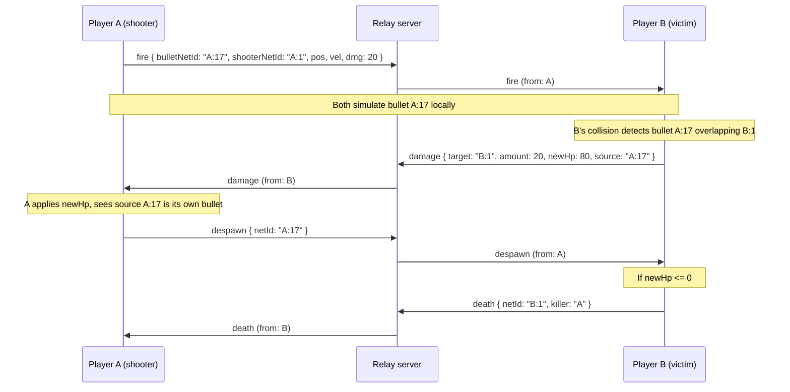

# Multiplayer Protocol

The wire protocol shared by the relay server (`server/`) and the engine client.
The server is a **dumb relay**: it runs no simulation, never interprets
gameplay payloads and only routes messages between players. All gameplay
decisions happen on the clients.

| Item | Value |
| --- | --- |
| Transport | WebSocket, one JSON object per message. |
| Source of truth | [`server/src/protocol.ts`](../server/src/protocol.ts) — types plus a runtime validator for every message. This document describes it for humans. |
| Version | `PROTOCOL_VERSION = 1`, sent by the client in `hello.version`. |
| Max message size | `MAX_MESSAGE_BYTES = 16384` (16 KB). Larger messages are dropped. |
| Units | Positions in world pixels, velocity in px/s, acceleration in px/s², **rotation in radians** (same as `TransformComponent.rotation`). |

---

## Envelope

Every message is a JSON object with these fields, plus the payload fields of
its type:

```json
{ "t": "state", "from": "k3f9", "seq": 412, "ts": 1718000000123, "netId": "k3f9:1", "...": "..." }
```

| Field | Type | Meaning |
| --- | --- | --- |
| `t` | string | Message type (see the reference below). |
| `from` | string | PlayerId of the sender. **Stamped by the server**, overwriting whatever the client sent, so clients cannot spoof ownership. Clients may omit it. |
| `to` | string, optional | PlayerId of a single recipient. Omitted means broadcast. |
| `seq` | integer >= 0 | Per-sender counter. Receivers drop a `state` whose `seq` is not greater than the last one seen from that sender. |
| `ts` | number | Sender's clock in milliseconds. Informational only; clocks are not synchronised. |

**Routing.** With `to` set, the server forwards only to that client (dropped if
unknown). Without it, the server broadcasts to everyone **except the sender**.

**Validation.** The server validates incoming messages with
`validateClientMessage` (full payload check, `from` not required; use
`isClientEnvelope` for an envelope-only check), stamps `from`, then forwards. Receivers can use
`validateMessage`, which requires `from`. Messages of server-only types
(`welcome`, `peer_joined`, `peer_left`, `host_changed`) sent by a client are
dropped (`isServerOnlyType`).

---

## Net IDs

Every networked entity has a `netId` of the form `"<playerId>:<counter>"`, for
example `"k3f9:17"`. It is generated by the **owner** from its own counter, so
no server allocation is needed and IDs never collide. `netIdOwner` returns the
original generator; after host migration the *current* owner can differ, so
always use the `owner` field from `spawn` / `snapshot` for authority.

---

## Ownership rules

1. **Everyone simulates everything.** Events correct the local simulation; they
   do not replace it. A bullet flies on every client from `fire` onward, and
   `state` only nudges remote copies back towards the owner's truth.
2. **Every networked entity has an owner.** A player owns their ship and their
   bullets. The **host** (earliest-joined player still connected) owns world
   entities: asteroids, enemies, loot and the game director.
3. **Only the owner spawns** an entity (`spawn`) **and only the owner removes
   it** (`despawn` / `death`). Nobody else may create or delete it.
4. **Receiver-authoritative critical events.** HP changes and deaths are
   decided **only by the owner of the entity being hit**, from its own local
   collision detection. Everyone else applies the owner's `damage` / `death`
   events and never changes HP on their own. This avoids disagreements caused
   by latency: the victim sees the hit as it really happened on its screen.
5. **Host migration.** When the host leaves, the server sends `host_changed`
   and the new host adopts every entity the old host owned.

---

## Message reference

Sender is who may legitimately originate the message. Direction is relative to
the server. "Broadcast" excludes the sender.

### Session

| Type | Direction | Sender | Fields | Notes |
| --- | --- | --- | --- | --- |
| `welcome` | server -> client | server | `playerId`, `hostId`, `peers[]` | Direct, first message after connecting. |
| `peer_joined` | server -> clients | server | `playerId` | A new player connected. |
| `peer_left` | server -> clients | server | `playerId` | A player disconnected. |
| `host_changed` | server -> clients | server | `hostId` | The host left; rule 5. |
| `hello` | client -> server | client | `name`, `version` | Sent once after connecting. `version` must equal `PROTOCOL_VERSION`. |

```json
{ "t": "welcome", "from": "server", "seq": 0, "ts": 1718000000000,
  "playerId": "k3f9", "hostId": "a1b2", "peers": ["a1b2"] }
```

### Entities

| Type | Direction | Sender | Fields | Notes |
| --- | --- | --- | --- | --- |
| `spawn` | client -> all | owner | `netId`, `owner`, `script`, `state` | `state` is `{ pos, vel, rot, acc, hp? }` plus any script-specific extras. `script` names the Lua script to attach. Rule 3. |
| `despawn` | client -> all | owner | `netId` | Removes the entity everywhere. Rule 3. |
| `state` | client -> all | owner | `netId`, `pos`, `vel`, `rot`, `acc` | Periodic correction of the owner's entity. Stale ones (by `seq`) are dropped. Rule 1. |

```json
{ "t": "state", "from": "k3f9", "seq": 412, "ts": 1718000000123, "netId": "k3f9:1",
  "pos": { "x": 640.5, "y": 360 }, "vel": { "x": 12, "y": -3 },
  "rot": 1.5708, "acc": { "x": 0, "y": 0 } }
```

### Combat

| Type | Direction | Sender | Fields | Notes |
| --- | --- | --- | --- | --- |
| `fire` | client -> all | shooter | `bulletNetId`, `shooterNetId`, `pos`, `vel`, `dmg` | A bullet was fired; every client simulates it locally. The shooter owns the bullet. |
| `damage` | client -> all | owner of `target` | `target`, `amount`, `newHp`, `source?` | Rule 4. Receivers set the target's HP to `newHp`. `source` is the bullet / entity netId. |
| `death` | client -> all | owner of `netId` | `netId`, `killer?` | Rule 4. `killer` is a PlayerId. |

```json
{ "t": "damage", "from": "b7c8", "seq": 90, "ts": 1718000001000,
  "target": "b7c8:1", "amount": 20, "newHp": 80, "source": "k3f9:17" }
```

### Loot

| Type | Direction | Sender | Fields | Notes |
| --- | --- | --- | --- | --- |
| `pickup_request` | client -> loot owner | any player | `lootNetId` | Sent direct (`to`) to the loot's owner, normally the host. |
| `loot_taken` | client -> all | loot owner | `lootNetId`, `by` | Broadcast reply; **first request wins**. Later requests for the same loot are ignored. |

### Join and settings

| Type | Direction | Sender | Fields | Notes |
| --- | --- | --- | --- | --- |
| `snapshot_request` | client -> all | joining player | (none) | A plain broadcast; the server does not treat it specially. Only the host answers. |
| `snapshot` | client -> client | host | `entities[]`, `settings` | Direct (`to` = requester). Each entity is `{ netId, owner, script, state }`; `settings` is `{ pvp }`. |
| `room_settings` | client -> all | host | `pvp` | Changes room-wide settings. |

---

## Example: a bullet hits a remote player

Player A shoots player B. A owns the bullet `A:17`, B owns its ship `B:1`.
Following rule 4, B alone decides the hit and the damage.



1. **A fires.** A creates the bullet locally and broadcasts `fire` with the
   bullet's `bulletNetId` (`A:17`), start position, velocity and damage. The
   server stamps `from: "A"` and forwards it to B.
2. **Everyone simulates.** B creates its own copy of `A:17` from the event and
   both clients move it with the same physics (rule 1). No further messages
   are needed while it flies.
3. **B detects the hit.** B's collision system sees `A:17` overlap its ship
   `B:1`. Only B, as owner of the entity being hit, may act on this (rule 4).
4. **B reports the damage.** B reduces its own HP and broadcasts `damage` with
   `target: "B:1"`, `amount`, the resulting `newHp` and `source: "A:17"`.
   Other clients set B's HP to `newHp`; they never compute it.
5. **A removes its bullet.** Receiving `damage` whose `source` is its own
   bullet (or its own local collision), A, as the bullet's owner, broadcasts
   `despawn { netId: "A:17" }` (rule 3). B drops its copy of the bullet.
6. **If B dies.** When `newHp <= 0`, B broadcasts `death { netId: "B:1",
   killer: "A" }` and then despawns its ship as the owner (rules 3 and 4).

---

## Host migration

The host is the earliest-joined player still connected. When it disconnects
the server broadcasts `peer_left` and then `host_changed { hostId }` naming
the next oldest player. The new host **adopts** every entity whose owner was the
old host (asteroids, enemies, loot, the director) by rewriting the owner locally
and taking over simulation and authoritative events for them. NetIds keep the
old prefix and stay valid. Players' own ships and bullets are unaffected.
